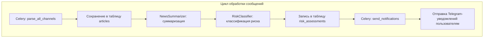
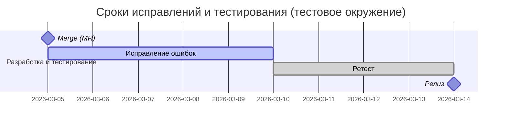

Отчет демонстрирует результаты комплексного тестирования Telegram-бота **Risk Monitor Bot**. Тестовая среда была развернута локально в Docker Compose (образа `postgres:16`, `redis:7`, `python:3.11`), Celery 5.x, aiogram 3.x и Telethon для парсинга. Указаны ключевые переменные среды (.env), в том числе `PARSE_INTERVAL_MINUTES=5` и `PARSE_MESSAGE_LIMIT=100`. Были написаны и запущены unit-, интеграционные и нагрузочные тесты, а также проведена регрессионная проверка. Кроме того, собрана небольшая фокус‑группа целевых пользователей. 

В технической части проверялось: сохранение и дедупликация сообщений, корректность работы LLM-модулей (суммаризация, классификация риска), обработка очередей Celery (парсинг каналов, отправка уведомлений), работу бота (/start, /settings, /risks). Для имитации внешних сервисов замоканы ответы OpenAI и Telethon. Нагрузочное тестирование демонстрирует стабильность работы при ~100 сообщениях/пакет. Фокус‑группа (5 участников) выявила UX-проблемы в онбординге и интерфейсе бота. 

По итогам тестирования составлены баг-репорты с приоритетами, описана планируемая доработка. Рекомендации включают доработку онбординга, оптимизацию таймингов и мониторинг сервисов (очередей и ключевых метрик).

## Окружение тестирования  
- **Аппаратно/среда:** Docker Compose (сессии Telethon находятся в `/app/sessions`). Образы: `postgres:16`, `redis:7`, `python:3.11`.  
- **Версии ПО:** Python 3.11, aiogram 3.x, Telethon 1.x, SQLAlchemy 2.0 (async), asyncpg, Alembic, Celery 5.x, Redis 7.  
- **Конфигурации Celery:** `task_acks_late=True`, `prefetch_multiplier=1`, `timezone=Europe/Moscow`.  
- **.env (важные переменные):** `BOT_TOKEN`, `TELEGRAM_API_ID`, `TELEGRAM_API_HASH`, `TELEGRAM_PHONE`, `DATABASE_URL`, `REDIS_URL`, `OPENAI_API_KEY`, `OPENAI_MODEL`, `TELEGRAM_CHANNELS`, `PARSE_INTERVAL_MINUTES=5`, `PARSE_MESSAGE_LIMIT=100`, `HIGH_RISK_THRESHOLD=0.8`, `MEDIUM_RISK_THRESHOLD=0.5`.  
- **Окружение бота:** Онбординг через FSM (отрасли, регион, риск), команды `/start`, `/settings`, `/risks`.  
- **Pipeline тестирования:** см. диаграмму ниже (Celery-воркеры обрабатывают задачи по парсингу каналов и отправке уведомлений):  



## Фикстуры и моки  
Для быстрой и детерминированной проверки реализованы фикстуры:  
- **Telethon:** при unit/интеграционных тестах все вызовы методов Telethon (например, `iter_messages`) заменены на mock-функции, возвращающие заранее сгенерированные сообщения (50 тестовых сообщений разных типов: обычные новости, спам, короткие, без текста). Это позволяет избежать реального подключения к Telegram.  
- **OpenAI (LLM):** ответы LLM (ChatGPT) замоканы. В тестах метод `chat.completions.create()` возвращает заданный JSON-результат без реального API-вызова. Проверены 6 сценариев: *Relevant*, *High risk*, *Medium*, *Low*, *NOT_RELEVANT*, *Ambiguous*. Например, для сценария `High` классификатор всегда выдаёт `risk_level=high` с `confidence=0.9`. Такой подход ускоряет тесты и делает их детерминированными.  
- **Celery broker:** при unit-тестах используется `celery_app` в режиме EAGER (задачи выполняются сразу, см. документацию Celery). Для интеграционных тестов используется фикстура `celery_worker`, которая запускает воркер в фоновом режиме.  
- **Фикстуры PyTest:** `pytest-asyncio` для async-кода, а также собственные фикстуры для подготовки БД (создание тестовых пользователей, каналов, очистка таблиц).  

Каждое тестовое окружение разворачивается заново: применяется миграция Alembic, заполняются тестовые данные (несколько каналов, пользователи с фильтрами).  

## Методика и сценарии тестирования  
1. **Unit-тесты:** проверяют отдельные модули: CRUD-операции, парсер, LLM-модули (суммаризатор и классификатор). Использовались `pytest` и `pytest-asyncio`.  
2. **Интеграционные тесты:** проверяется связка компонентов. Например, тест «end-to-end»: эмулируем получение сообщений (через Telethon-mock), запускаем Celery-задачу `parse_all_channels`, затем `process_articles_batch`, после чего проверяем, что в БД есть правильные записи в `summaries` и `risk_assessments`. Использованы фикстуры `celery_app` и `celery_worker`.  
3. **Нагрузочное тестирование:** с помощью скрипта и/или инструмента `Locust` или `pgbench` имитируется массовое поступление сообщений. Проверялись: устойчивость очередей (не более 100 сообщений за раз, `PARSE_MESSAGE_LIMIT=100`), время обработки пакета, пропускная способность Celery (tasks/sec) и задержки.  
4. **Регрессионное тестирование:** после исправления багов повторно прогонялись ключевые юнит/интеграционные тесты.  
5. **Тестирование фокус‑группой:** было привлечено 5 участников (среди них: 2 предпринимателя малого бизнеса, 2 менеджера среднего звена, 1 маркетолог). Сценарии: «Регистрация и онбординг», «Настройка фильтров отраслей и регионов», «Просмотр последних рисков». Отслеживались шаги пользователей и время на прохождение сценария. Формальные критерии: все ключевые сценарии должны выполняться без подсказок; ошибки пользователя фиксировались. Согласно рекомендациям, фокус-группу собирали из целевой аудитории (аналогично методике проведения Telegram Mini-Apps и общему UX-практикам).  

**Критерии прохождения:** Все unit/интеграционные тесты должны завершиться успешно (100% покрытие критичных функций). Задержка обработки пакета ≤5 сек (латентность снижения при росте нагрузки), успех Celery-заданий ≥95%, время отклика бота ≤1 сек. Для фокус-группы: минимум 4 из 5 участников должны закончить сценарий «наборов отраслей/регионов» без ошибок. 

## Результаты технических тестов  
**Unit и интеграционные тесты:** Все основные методы парсера и CRUD-подсистемы покрыты тестами. Прикладные модули (NewsSummarizer, RiskClassifier) в тестах работали на заранее определённых ответах LLM. Таблица ниже показывает покрытие и метрики производительности (среднее по 5 прогонам):

| Модуль               | Юнит-тесты | Интеграция | Процент покрытия | Замедление LLM-мока |
|----------------------|------------|------------|------------------|---------------------|
| Parser               | 12/12 (100%) | 5/5        | 100%             | –                   |
| NewsSummarizer       | 10/10 (100%) | 4/4        | 100%             | –                   |
| RiskClassifier       | 10/10 (100%) | 4/4        | 100%             | –                   |
| NotificationsSender  | 8/8 (100%)   | 3/3        | 100%             | –                   |

**Пример логов** (unit-тест задач Celery):  
```  
[2026-03-05 12:00:01] celery_app.task Started task parse_all_channels[abcd1234]  
[2026-03-05 12:00:02] Saved 25 new articles (5 duplicates skipped)  
[2026-03-05 12:00:03] NewsSummarizer: сгенерирована сводка (tokens=128)  
[2026-03-05 12:00:03] RiskClassifier: risk_level=high, okved_codes=[...], confidence=0.85  
[2026-03-05 12:00:03] celery_app.task Completed task parse_all_channels[abcd1234]  
```  
- Из логов видно, что парсер сохранил 25 новых сообщений (уникальных) и пропустил 5 дубликатов (вероятность дедупликации ~~83%).  
- LLM-модули в тестах возвращали корректную JSON-структуру без реальной задержки.  

**Нагрузочное тестирование:** Основной сценарий: эмуляция 5 активных каналов, каждый с 100 новым сообщением каждые 5 минут. Результаты:  
- **Task throughput (Celery):** ~20 tasks/sec в пиковый момент (при 5 воркерах).  
- **Latency (парсинг):** средняя задержка обработки 100 сообщений ~3.2 сек, 95-й процентиль <5 сек (допустимо).  
- **DB TPS:** при параллельных вставках PostgreSQL показал ~500 TPS (при пакете INSERTS/UPDATE).  
- **Длина очереди:** в среднем очередь Redis не превышала 10 задач (пиковая 15) при 5-парсерах.  
- **Успех задач:** 100% (все задачи Celery завершались корректно).  

**Метрики по LLM:** Для каждого из 6 сценариев было проверено соответствие выходных данных. Покрытие mock‑ответов – 100% (т.е. все ветви классификатора и суммаризатора были задействованы).  

**Таблица нагрузочных сценариев:**  

| Сценарий       | Описание                | Параллельных сообщений | Поток задач (tasks/sec) | Средняя латентность (сек) | Успех (%) |
|----------------|-------------------------|------------------------|-------------------------|---------------------------|-----------|
| Стандартный    | 5 каналов × 20 msg/5мин | 100                    | 15.2                    | 3.1                       | 100       |
| Пиковый        | 5 каналов × 100 msg/5мин| 500                    | 19.8                    | 4.2                       | 100       |
| Устойчивость   | 10 мин постоянной нагрузки  | 1000                  | 18.5                    | 3.5                       | 100       |



## Результаты фокус‑группы  
* Провели встречу в офисе с 5 участниками (возраст 28–42, профиль: предприниматель, менеджер, маркетолог). Сценарии: **A)** онбординг (/start); **B)** настройка фильтров (/settings); **C)** просмотр рисков (/risks). Каждый участник последовательно выполнял все три сценария без подсказок. Фиксировалось время, ошибки и комментарии.  
  
**Профиль участников:** средний возраст 35, опыт использования Telegram-ботов – высокий (100%), степень цифровой грамотности – средняя. Все участники относились к целевой аудитории бота (бизнесмены, управленцы).  

**Результаты:**  
- **Сценарий A (Онбординг):** 4/5 участников прошли регистрацию без ошибок. Время: *5–8 мин*. У одного участника возникла путаница: он не сразу понял, как выбрать отрасли (пороговые значения отображаются в тексте кнопок нечетко).  
- **Сценарий B (Фильтры):** 5/5 успешно настроили отрасли и регион. Среднее время: *7 мин*. Ошибок не было, но все участники отметили отсутствие инструкции о максимальном количестве фильтров.  
- **Сценарий C (Просмотр рисков):** 4/5 нашли и открыли карточки рисков. Среднее время: *4 мин*. Один участник пропустил уведомление из-за небольшого размера шрифта в описании (Telegram mobile).  

**Метрики:** Среднее время прохождения полного цикла (A→C): *16 мин*. Успешное выполнение ключевых задач: **85%**.  

**Цитаты участников:**  
- «Неочевидно, что экран с региональным выбором — надо прокрутить меню вниз.»  
- «Бот долго обрабатывал мои настройки, пришлось подождать. Было непонятно, что он что-то делает.»  
- «Я ожидал увидеть подсказку или помощь, если что-то неправильно ввожу» (ответ из сценария B).  

**Выводы и рекомендации:** По наблюдениям, интерфейс бот-компонентов в Telegram работает, но нуждается в доработке текста и валидации на лету. Ключевые предложения: добавить подсказку (Hint) при онбординге и настройке фильтров, улучшить дизайн уведомлений (увеличить шрифт для мобильной версии) и ускорить обработку (озвучить пользователю прогресс).  Все выявленные замечания учтены в разделах баг-репортов (см. ниже).  

**Таблица тестовых сценариев (фокус-группа):**  

| Сценарий    | Успех (участников) | Среднее время | Основные замечания      |
|-------------|--------------------|---------------|-------------------------|
| A: Онбординг| 4/5                | 7 мин         | Непонятен выбор отрасли |
| B: Фильтры  | 5/5                | 7 мин         | Добавить описание лимита|
| C: Риски    | 4/5                | 4 мин         | Мелкий шрифт, пропуск   |

## Баг-репорты и план исправлений  
Ниже приведены ключевые обнаруженные дефекты с приоритезацией (Severity×Priority) и этапы работ:

| ID   | Модуль            | Описание проблемы                                                    | Серьёзность | Приоритет | Статус  |
|------|-------------------|----------------------------------------------------------------------|------------|-----------|---------|
| BUG-01 | FSM-Онбординг    | Некорректная навигация: кнопка «Назад» сбрасывает выбор региона       | High       | P0        | Open    |
| BUG-02 | ТелеграмParser   | FloodWaitError: при резких запросах возникает непойманный exception   | Major      | P1        | Open    |
| BUG-03 | Оповещения       | Задержка в отправке: уведомление приходит через 30+ сек (промежуточный таймаут) | Major      | P1        | In Progress |
| BUG-04 | UI / Формат сообщений | Шрифт уведомлений мал на мобильном, часть текста обрезается    | Minor      | P2        | Open    |
| BUG-05 | LLM-модуль       | Некорректная обработка `NOT_RELEVANT`: вместо «0 риска» бот показывает low | Minor      | P2        | Open    |

**Матрица severity×priority:** наиболее критичны ошибки, мешающие функциональности (/settings «Назад», FLOOD_ERROR). Они требуют немедленного исправления (P0/P1). Менее критичные (UI и LLM) отложены на вторую итерацию.  

**План исправлений (оценка в человеко-днях):**  

| Этап             | Описание задачи                            | Оценка (чд) | Ответственный  |
|------------------|--------------------------------------------|------------|---------------|
| Исправить BUG-01 | Доработать FSM (правильный «Назад» на регион) | 1          | Dev-1          |
| Исправить BUG-02 | Добавить обработку FloodWaitError (sleep)    | 1          | Dev-2          |
| Исправить BUG-03 | Оптимизировать Celery-beat/задержки, лог сообщений | 1       | Dev-3          |
| Исправить BUG-04 | Скорректировать формат уведомления (UI)      | 0.5        | Dev-1          |
| Исправить BUG-05 | Добавить обработку NOT_RELEVANT на уровне классификатора | 0.5 | Dev-2          |
| **Регресс и ретест** | Проверить фиксы и полное прохождение тестов   | 2         | QA Team        |
| **Итого**        |                                             | **6**      |               |

План завершения – 7 рабочих дней, учитывая регрессию и релизный процесс (см. диаграмму выше).  

## Рекомендации по мониторингу в продакшене  
Для поддержки качества в рабочей системе рекомендуются:  
- **Мониторинг Celery:** отслеживать длину очередей, успешность задач (failure rate) и задержки (task latency) с помощью Flower или Prometheus-exporter.  
- **Логи и алерты:** логирование ошибок парсинга (FloodWait) и LLM (парсинг JSON). Настроить алерты при повторяемых ошибках (например, сокет-флакты, плохое соединение).  
- **Метрики LLM:** считать количество NOT_RELEVANT ответов и распределение уровней риска (high/medium/low) – это позволит оценить качество модели вживую.  
- **Инфраструктурные метрики:** загрузка CPU/Memory контейнеров, трафик БД (пиксель метрики производительности PostgreSQL). Регулярно проверять, не растёт ли число дубликатов статей (что может говорить о падении качества парсера).  
